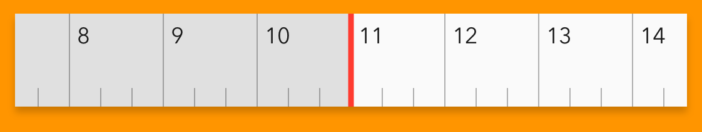

# LFTimelineControl

<!-- [](https://travis-ci.org/Chris/LFTimelineControl) -->
[](https://cocoapods.org/pods/LFTimelineControl)
[](https://cocoapods.org/pods/LFTimelineControl)
[](https://cocoapods.org/pods/LFTimelineControl)



## Description

LFTimelineControl is a custom UIKit control designed primarily to be used as a timeline scrubber for tempo-based audio.

The timeline is displayed with demarkations of beats and bars, bars are numbered. Scrolling is infinite.

The timeline supports inertial scrolling, and deceleration will always come to rest on a bar marker. Panning will also snap to a the closest bar marker when completed.

## Installation
LFTimelineControl is available through [CocoaPods](https://cocoapods.org). To install
it, simply add the following line to your Podfile:

```ruby
pod 'LFTimelineControl'
```

## Usage
The current location of the control can be read using its `location` property.

Add a target to the control's `UIControl.valueChanged` to observe user-initiated changes.

Use the `setPostition(_:,animated: )` method to change the control's location programatically, with or without animation.

## Author
Chris Rivers, chris@lofionic.co.uk

## License
LFTimelineControl is available under the MIT license. See the LICENSE file for more info.
